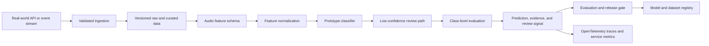

# Architecture

## Problem

Operations teams need an explainable starting point for classifying alarms, machinery noise, and speech-like events.

## System Flow

## Components

- **Audio feature schema**
- **Feature normalization**
- **Prototype classifier**
- **Low-confidence review path**
- **Class-level evaluation**

## Recommended Production Stack

- FastAPI for audio metadata and prediction APIs
- Transformers with Wav2Vec2 or audio spectrogram models
- librosa or torchaudio for feature extraction
- MLflow for experiment and model registry
- Object storage for licensed audio
- OpenTelemetry for inference latency and error traces

## Hugging Face Tasks

- `audio-classification`
- `automatic-speech-recognition`
- `feature-extraction`
- `audio-to-audio`

## Model Architecture

The included baseline is a transparent token-prototype model. Training builds
per-label token weights and inverse-document-frequency retrieval weights from
the synthetic training split. The runtime returns a prediction, confidence,
review flag, and evidence documents. This baseline is intentionally small so
it can run in CI without paid compute.

For production, compare it with domain embeddings, gradient-boosted models, or
fine-tuned transformer models using the same held-out evaluation contract.

## Production Boundaries

- Validate and version all input schemas.
- Keep human review for low-confidence or high-impact decisions.
- Store prompts, traces, model versions, and dataset versions together.
- Do not treat synthetic evaluation performance as production evidence.
- Add authentication, authorization, encryption, and retention controls.

## Known Risks

The included records are synthetic feature vectors and do not replace evaluation on licensed real audio.
